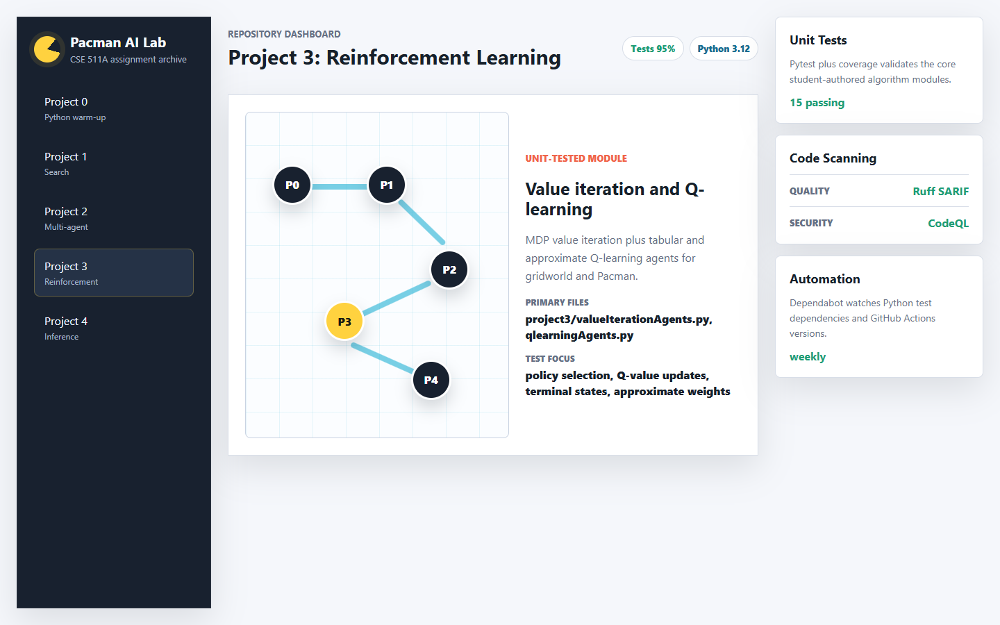

# CSE 511A Pacman AI

This repository is a college assignment archive for the classic Pacman AI project sequence. The code is organized as five standalone Python project folders that build from Python warm-up exercises into search, adversarial planning, reinforcement learning, and probabilistic inference.

The original codebase was Python 2-era course code. It has been modernized enough to run and test on Python 3.12 while preserving the original assignment structure.



## What This Repo Does

The repository contains implementations and support code for Pacman AI assignments:

| Folder | Topic | What it contains |
| --- | --- | --- |
| `project0/` | Python warm-up | Fruit shop exercises, list comprehensions, quick sort, and basic Python control flow. |
| `project1/` | Search | Generic graph search algorithms used by Pacman search agents: depth-first search, breadth-first search, uniform-cost search, and A*. |
| `project2/` | Multi-agent search | Reflex, minimax, alpha-beta, and expectimax-style Pacman agents for games with ghosts. |
| `project3/` | Reinforcement learning | Value iteration, Q-learning, approximate Q-learning, Gridworld, crawler, and related learning agents. |
| `project4/` | Probabilistic inference | Exact inference, particle filtering, joint particle filtering, and Ghostbusters-style noisy observation tracking. |

The projects include Pacman layouts, text displays, graphical display support, game rules, agent abstractions, and assignment-specific algorithm files.

## Unit Tests

Unit tests now live in `tests/`. They focus on deterministic, unit-testable assignment logic rather than graphical game loops.

Covered areas:

- `project0`: fruit order totals, missing fruit handling, and lowest-cost shop selection.
- `project1`: BFS, DFS, UCS, A*, no-solution behavior, and Python 3-compatible `Counter` helpers.
- `project3`: value iteration policy selection, Q-learning updates, terminal-state handling, exploration, Pacman Q-agent action bookkeeping, and approximate Q-learning weights.

Run the tests:

```bash
python -m pytest
```

Run tests with the coverage gate used by CI:

```bash
python -m coverage run -m pytest
python -m coverage report --fail-under=90
```

Current local result:

```text
15 passed
95% line coverage on the unit-tested core modules
```

Coverage is intentionally scoped by `.coveragerc` to the tested assignment implementation modules. The old graphical engines, command-line demos, and course scaffolding are still compiled in CI, but they are not counted as unit-tested algorithm code.

## Local Interface

A small static dashboard is available in `docs/`.

Open it directly in a browser:

```text
docs/index.html
```

Or serve it locally:

```bash
cd docs
python -m http.server 8765 --bind 127.0.0.1
```

Then visit:

```text
http://127.0.0.1:8765/
```

The dashboard summarizes the five projects, highlights the tested modules, and mirrors the CI sections for unit tests, quality scanning, security scanning, and dependency automation.

## GitHub Actions Pipeline

The workflow is defined in `.github/workflows/ci.yml` and runs on pushes and pull requests targeting `main` and `dev`.

### Unit Tests

The `Unit Tests` job:

- checks out the repository,
- sets up Python 3.12,
- installs `requirements-dev.txt`,
- compiles all project folders with `compileall`,
- runs `pytest` through `coverage`,
- fails if covered core modules drop below 90% line coverage.

### Code Scanning

GitHub code scanning is configured as its own pipeline area with quality and security split into separate jobs.

#### Quality

The `Code Scanning / Quality` job:

- runs Ruff using the rules in `pyproject.toml`,
- writes Ruff findings as SARIF,
- uploads SARIF with `github/codeql-action/upload-sarif`,
- runs a Ruff quality gate.

The current Ruff configuration focuses on high-signal Python errors (`E9`, `F63`, `F7`, `F82`) so the old course scaffold is not overwhelmed by style-only lint churn.

#### Security

The `Code Scanning / Security` job:

- runs GitHub CodeQL for Python,
- publishes CodeQL results to GitHub code scanning.

GitHub documents code scanning as available for public repositories and for organization-owned repositories with GitHub Code Security enabled. See GitHub's code scanning documentation: <https://docs.github.com/en/code-security/concepts/code-scanning/code-scanning>.

The pull-request-only `Code Scanning / Security / Dependency Review` job:

- runs `actions/dependency-review-action`,
- fails pull requests that introduce dependencies with moderate-or-higher known vulnerability severity.

GitHub documents dependency review as available for public repositories and private repositories with GitHub Code Security or GitHub Advanced Security enabled. See GitHub's dependency review documentation: <https://docs.github.com/en/code-security/concepts/supply-chain-security/dependency-review>.

### Dependency Automation

Dependabot is configured in `.github/dependabot.yml` for:

- Python dependencies in `requirements-dev.txt`,
- GitHub Actions versions in `.github/workflows/`.

Dependabot checks weekly and opens up to five pull requests per ecosystem.

## Notable Code Improvements

- Converted Python 2 syntax to Python 3-compatible syntax across the project folders.
- Fixed Python 3 compatibility in shared `Counter.sortedKeys()` and module lookup helpers.
- Fixed `project1/search.py` breadth-first search so it returns a valid shortest action path instead of falling through to `Fail`.
- Fixed Q-learning terminal action handling so `getAction()` returns `None` when no legal actions exist.
- Fixed approximate Q-learning weight storage so weights remain a `Counter`.
- Fixed approximate Q-learning updates to use the temporal-difference error.
- Replaced old string-style exceptions with Python 3 exception objects in touched support files.

## Development Notes

Install test dependencies:

```bash
python -m pip install -r requirements-dev.txt
```

Compile all Python files:

```bash
python -m compileall -q project0 project1 project2 project3 project4
```

Run the quality scanner locally:

```bash
ruff check .
```

Some assignment files are still best treated as course scaffolding or interactive demos. The reliable automated path is the unit test and coverage command above, plus the CI compile smoke check over all project folders.
